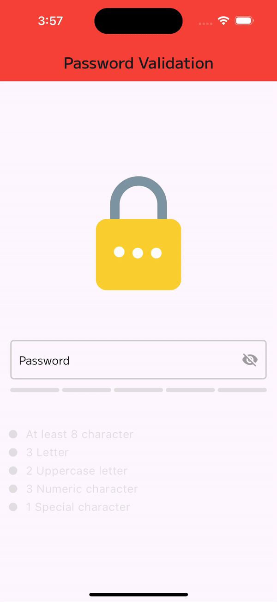

# Password Validation App

This is a Flutter app that validates a user's password based on certain criteria, such as minimum length, required number of uppercase characters, digits, and special characters. The app also includes a feature to reveal/hide the password text by tapping an eye icon.

## Features

- User-friendly UI with Google Fonts and Lottie animations
- Password validation based on customizable criteria
- Visual feedback on password strength using color coding and animations
- Obscured password entry for security

## Demo

The app includes a demo GIF to showcase its functionality:

This demo shows the app interface when the password meets the validation criteria. The app displays a green AppBar and a "success" animation to indicate a valid password. You can also see, the user can tap the eye icon in the password field to reveal or hide the password text.

## Installation

1. Clone the repository or download the source code.
2. Open the project in your preferred IDE (e.g., Android Studio, Visual Studio Code).
3. Ensure that you have Flutter installed and set up correctly.
4. Run `flutter pub get` to install the required dependencies.
5. Connect a device or start an emulator/simulator.
6. Run the app using `flutter run`.

## Dependencies

The app uses the following dependencies:

- `flutter_pw_validator`: A Flutter package for password validation with customizable criteria.
- `google_fonts`: A Flutter package for easy integration of Google Fonts.
- `lottie`: A Flutter package for rendering Lottie animations.

## Contributing

Contributions are welcome! If you find any issues or have suggestions for improvements, please open an issue or submit a pull request.

## License

This project is licensed under the [MIT License](LICENSE).
